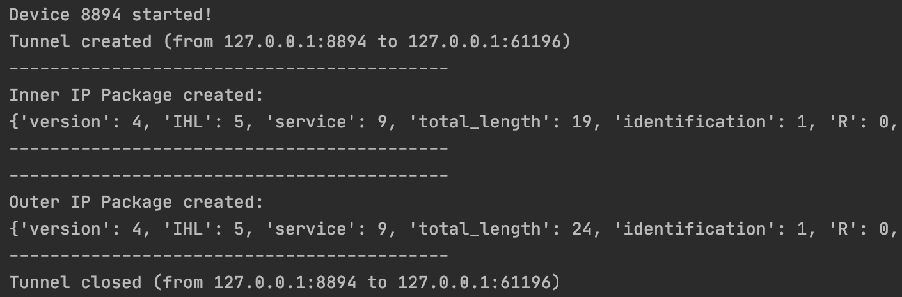
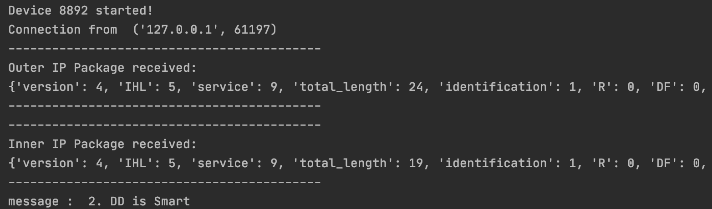

# IP in IP

Use socket in python to create tunnel & send message.

It must be awkward to admit that this is the first time I tried object-oriented programming, cause I always consider it procedure-oriented.

## encode : message -> inner ip package -> outer ip package

## decode : outer ip package -> inner ip package -> message
